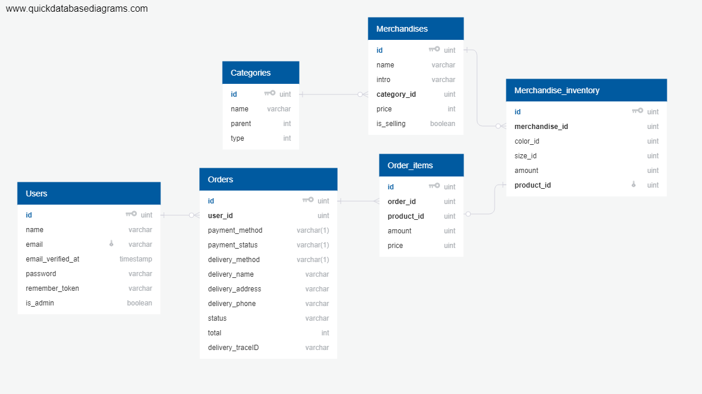

# 小型電商網站

---
## 簡介

參考販售衣物的電商，在閒暇之餘做的網站。以下簡單介紹功能： 

##### 使用者介面

##### 購物車

##### 後台管理

---
## Demo
##### Demo account
使用者 alice@example.com/123456 
管理者 bob@example.com/123456 

[link](https://example.com)

---
## DB Schema

<table>
<tr><th>Table Name</th><th>Functionality</th></tr>
<tr><td>Users</td><td>儲存使用者清單</td></tr>
<tr><td>Merchandises</td><td>儲存基本的商品資訊</td></tr>
<tr><td>Orders</td><td>儲存訂單</td></tr>
<tr><td>Merchandise_inventory</td><td>依據商品衍生出不同的顏色及尺寸，產生不同的product_id</td></tr>
<tr><td>Order_items</td><td>儲存每張訂單訂購的商品ID/價格/數量</td></tr>
<tr><td>Cateogries</td><td>為商品分類</td></tr>
</table>
